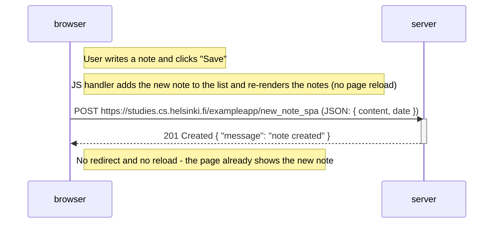

# Exercise 0.6 - New note in single page app

```mermaid
sequenceDiagram
    participant browser
    participant server

    Note right of browser: User writes a note and clicks "Save"
    Note right of browser: JS handler adds the new note to the list and re-renders the notes (no page reload)

    browser->>server: POST https://studies.cs.helsinki.fi/exampleapp/new_note_spa (JSON: { content, date })
    activate server
    server-->>browser: 201 Created { "message": "note created" }
    deactivate server

    Note right of browser: No redirect and no reload - the page already shows the new note
```
